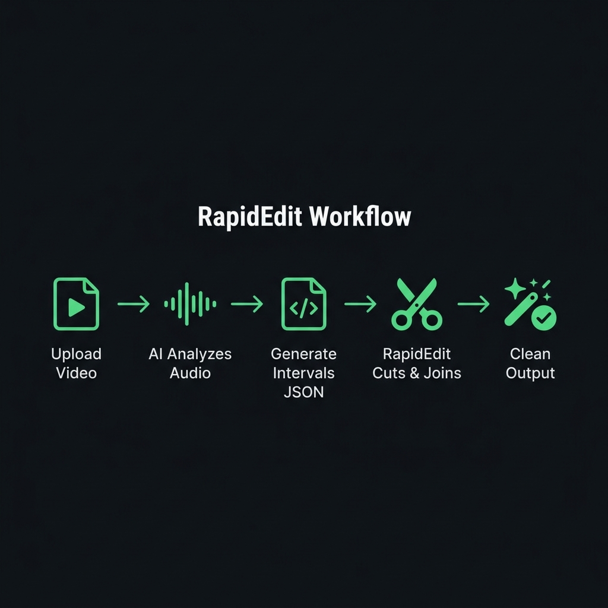

<p align="center">
  
</p>

<h1 align="center">⚡ RapidEdit</h1>
<p align="center">
  Remove silence, pauses, and filler sounds from videos.<br>
  Fast. Clean. Tight cuts. GPU accelerated.
</p>

<p align="center">
  
  
  
  
</p>

---

## How It Works

<p align="center">
  
</p>

1. **Upload video** to AI (Gemini / ChatGPT) with the [ai_prompt.md](ai_prompt.md)
2. **AI analyzes audio** — detects speech, silence, filler sounds
3. **AI outputs intervals** — timestamps of parts to keep
4. **Save as JSON** → feed to `rapid_edit.py`
5. **Clean output** — tight, professional video

---

## Tight Cut

Cut video using AI-generated keep intervals:

```bash
python3 rapid_edit.py -path input.mp4 -out clean.mp4 -config intervals.json
```

`intervals.json` format:
```json
{
  "intervals": [
    [0.73, 2.81],
    [3.19, 4.48],
    [5.62, 6.27]
  ]
}
```

---

## Split Video

Split any video into 10-second segments:

```bash
python3 split_10sec.py -path input.mp4
python3 split_10sec.py -path input.mp4 -out parts/ -duration 5
```

---

## What Gets Removed

| ❌ Removed | ✅ Kept |
|---|---|
| Silence | Speech |
| Long pauses | Natural breathing |
| Dead air | Tiny pauses near words |
| "umm", "uhh", "hmm" | Meaningful audio |
| Hesitation gaps | Original quality |

---

## Requirements

- Python 3.8+
- FFmpeg — `brew install ffmpeg` (macOS) or [ffmpeg.org](https://ffmpeg.org)

---

## Files

| File | Description |
|---|---|
| `rapid_edit.py` | Main tool — cuts video using keep intervals |
| `split_10sec.py` | Split video into segments |
| `ai_prompt.md` | AI prompt for silence/filler detection |
| `video_edit_prompt.md` | AI prompt for social media reel editing |
| `guide.md` | Detailed usage guide |

---

## License

MIT
