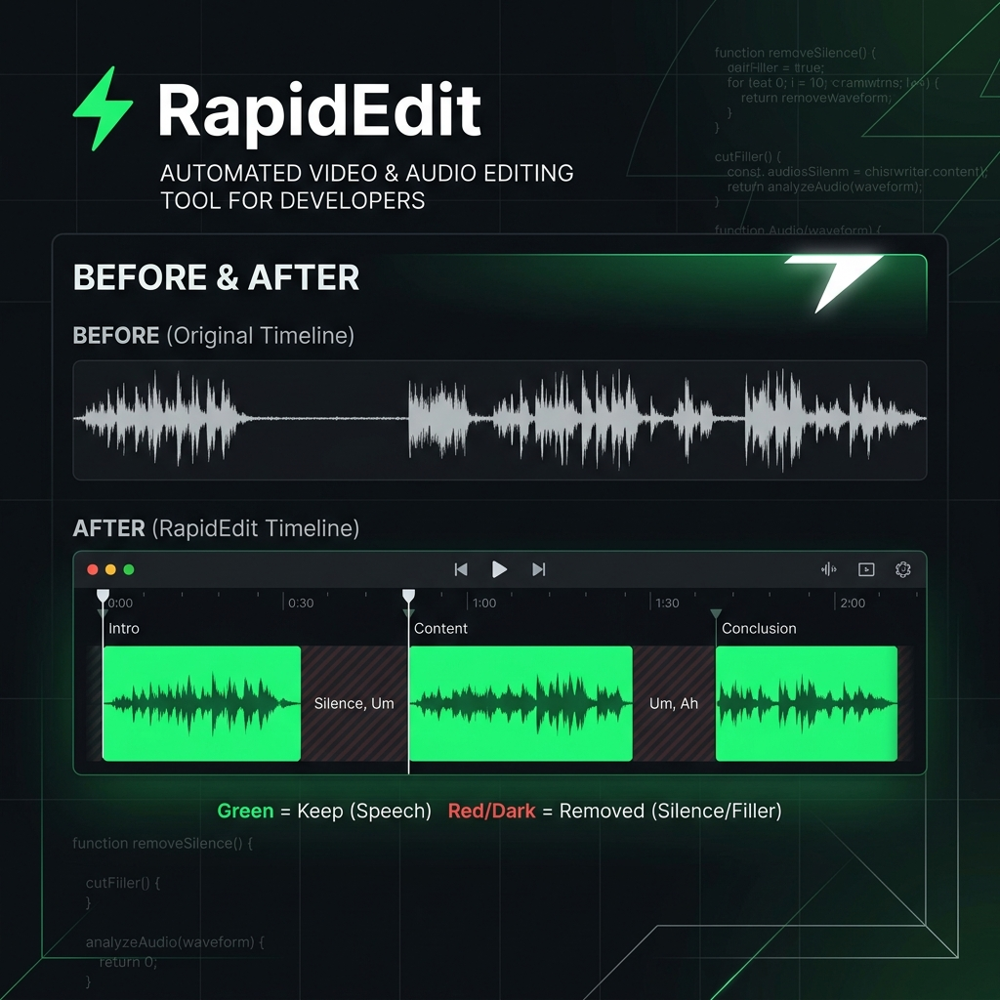

<p align="center">
  
</p>

<h1 align="center">⚡ RapidEdit</h1>
<p align="center">
  <b>Remove silence, pauses & filler sounds from any video in seconds.</b><br>
  AI-powered interval detection + FFmpeg GPU pipeline. No cloud. No subscription. Just fast edits.
</p>

<p align="center">
  <a href="#-quick-start"></a>
  <a href="https://github.com/kodelyx/RapidEdit/stargazers"></a>
  <a href="https://github.com/kodelyx/RapidEdit/fork"></a>
</p>

<p align="center">
  
  
  
  
</p>

---

## 🤔 The Problem

You recorded a 10-minute video. **3 minutes is silence, "umm"s, and dead air.**

Manual editing takes **30+ minutes**. AI tools like Descript cost **$24/month**.

**RapidEdit does it in seconds. For free. Locally.**

---

## ✨ How It Works

<p align="center">
  
</p>

```
Raw Video → AI Detects Speech → JSON Intervals → RapidEdit → Clean Video
  10 min        Gemini/GPT         config.json      FFmpeg+GPU      7 min
```

---

## 🚀 Quick Start

### 1. Clone

```bash
git clone https://github.com/kodelyx/RapidEdit.git
cd RapidEdit
```

### 2. Get intervals from AI

Upload your video to **Gemini** or **ChatGPT** with the prompt in [ai_prompt.md](ai_prompt.md).

AI will give you timestamps → save as `intervals.json`:

```json
{
  "intervals": [
    [0.73, 2.81],
    [3.19, 4.48],
    [5.62, 6.27]
  ]
}
```

### 3. Run

```bash
python3 rapid_edit.py -path input.mp4 -out clean.mp4 -config intervals.json
```

**That's it.** Output is a clean, tight video with only speech. 🎬

---

## 🔪 What Gets Removed

| ❌ Removed | ✅ Kept |
|---|---|
| Silence & dead air | Real speech |
| "umm", "uhh", "hmm" | Natural breathing |
| Long pauses | Tiny pauses near words |
| Hesitation gaps | Original video quality |
| Filler sounds | Audio sync & FPS |

---

## 🎯 Why RapidEdit?

| Feature | RapidEdit | Descript | CapCut | Manual |
|---|---|---|---|---|
| Price | **Free** | $24/mo | Free (limited) | Free |
| Speed | **Seconds** | Minutes | Minutes | 30+ min |
| Privacy | **100% Local** | Cloud upload | Cloud upload | Local |
| GPU Accelerated | **✅** | ❌ | ❌ | ❌ |
| Batch Processing | **✅** | ❌ | ❌ | ❌ |
| Quality Loss | **None** | Lossy | Lossy | Depends |
| Long Videos (1hr+) | **✅** | ❌ | ❌ | Pain |

---

## 🛠️ Tools Included

| Tool | What it does | Usage |
|---|---|---|
| `rapid_edit.py` | Cut & join video using keep intervals | `python3 rapid_edit.py -path video.mp4 -out clean.mp4 -config intervals.json` |
| `split_10sec.py` | Split video into segments | `python3 split_10sec.py -path video.mp4` |

---

## 📝 AI Prompts

| Prompt | Use Case |
|---|---|
| [ai_prompt.md](ai_prompt.md) | Upload video to Gemini/ChatGPT → get silence detection intervals |
| [video_edit_prompt.md](video_edit_prompt.md) | Generate premium social media reel edits |

---

## 📋 Requirements

```bash
# Python 3.8+
python3 --version

# FFmpeg
brew install ffmpeg          # macOS
sudo apt install ffmpeg      # Linux
# Windows: download from ffmpeg.org
```

---

## 🗂️ Project Structure

```
RapidEdit/
├── rapid_edit.py           # Main cutting engine
├── split_10sec.py          # Video splitter
├── ai_prompt.md            # AI prompt for interval detection
├── video_edit_prompt.md    # AI prompt for reel editing
├── config.json             # Example intervals config
├── guide.md                # Detailed usage guide
└── assets/
    ├── banner.png
    └── workflow.png
```

---

## 🤝 Contributing

Found a bug? Have an idea? [Open an issue](https://github.com/kodelyx/RapidEdit/issues) or submit a PR.

---

## ⭐ Star This Repo

If RapidEdit saved you time, **star this repo** — it helps others find it.

<p align="center">
  <a href="https://github.com/kodelyx/RapidEdit/stargazers">
    
  </a>
</p>

---

## 📄 License

MIT — use it however you want.
